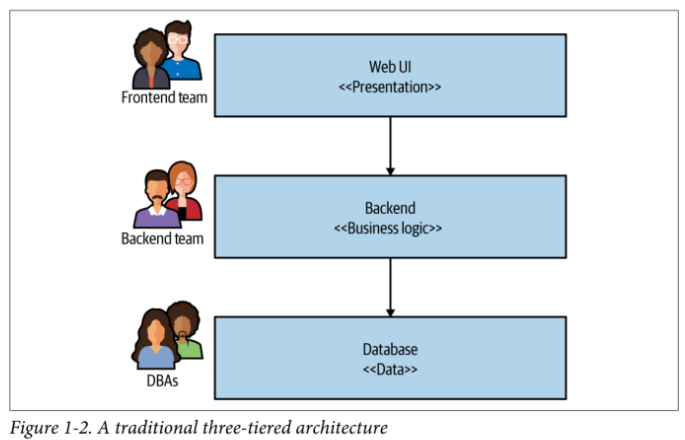

- [Chapter 1 - What are Microservices?](#chapter-1---what-are-microservices)
  - [Key concepts](#key-concepts)
  - [Alignment of Architecture and Organization\*\*](#alignment-of-architecture-and-organization)
  - [The Monolith](#the-monolith)
    - [Single-Process Monolith](#single-process-monolith)
    - [Modular Monolith](#modular-monolith)
    - [Distributed Monolith](#distributed-monolith)
    - [Monoliths and Delivery Contention](#monoliths-and-delivery-contention)
    - [Advantages of Monoliths](#advantages-of-monoliths)
  - [Enabling Technology](#enabling-technology)
    - [Log Aggregation and Distributed Tracing](#log-aggregation-and-distributed-tracing)
    - [Containers and Kubernetes](#containers-and-kubernetes)
    - [Streaming Platforms](#streaming-platforms)
    - [Public Cloud and Serverless](#public-cloud-and-serverless)
  - [Advantages of Microservices](#advantages-of-microservices)
  - [Microservice Pain Points](#microservice-pain-points)
  - [Should I Use Microservices?](#should-i-use-microservices)

# Chapter 1 - What are Microservices?

- Are independently releasable services that are modeled around a business domain.
- Each service has its own database.
- A change inside a microservice should not affect upstream or downstream services.

## Key concepts

- **Independent Deployability**

  - Each service can be deployed independently of other services.
  - This allows for faster deployment cycles.
  - We have to ensure a "loosely coupled" architecture. Change one service without the need to change others.

- **Modeled around a Business Domain**
  
  - Each service is modeled around a business domain.
  - DDD is a good approach to model microservices.
  - We must to ensure high cohesion of business functionality over technical functionality.

- **Owning their Own State**
  
  - Using a separate database for each service is a key characteristic of microservices.
  - This allows for each service to publish the public and non-very-volatile data to other services and hide the private data that could change more frequently than public data.
  - Is similar to Encapsulation in OOP.

- **Size**

  - A microservice should be as big as your head. If you can't hold the whole service in your head, it's too big.
  - Is a subjective concept, but it's a good rule of thumb. A person who have worked on a service with 100K lines of code could thing that a service with 10K lines of code is a microservice. A person who have worked on a service with 10K lines of code could thing that a service with 1K lines of code is a microservice. And so on.
  - Focus on two main things: How many microservices can you handle? How do you define the boundaries of a microservice?

- **Flexibility**

  - Microservices allow for flexibility in technology stack.
  - Each service can be written in a different language or use different technologies.

## Alignment of Architecture and Organization**

- Its better to align the architecture with the organization.
- Instead of having specialized teams of backend, frontend, QA for each layer, we can have cross-functional teams that own a microservice end-to-end.

## The Monolith

Unit of deployment is the entire application. It's a single codebase that is deployed all at once.

### Single-Process Monolith

All the code is running or deployed in a single process.

### Modular Monolith

The single-process monolith is divided into modules, but all the modules are deployed together.

We can have modular monoliths with a single DB with a coupling between modules.

Or we can have modular monoliths with multiple DBs to avoid coupling between modules.

### Distributed Monolith

The monolith is divided into services, but all the services are deployed together.

A service failure can bring down the **entire** application.

### Monoliths and Delivery Contention

Delivery Contention is when two teams are trying to deploy at the same time and they have to wait for each other.

This is a common problem in monoliths, also known as "merge hell".

### Advantages of Monoliths

- Easier to deploy, scale, and test than microservices.
- Reuse of code is easier.

## Enabling Technology

A well choosen technology stack is essential for microservices.

### Log Aggregation and Distributed Tracing

A log aggregation system must be a prerequisite for microservices. Will help us to debug and monitor the entire microservices architecture in a single place.

Different services can help us:

- **Grafana Loki**
- **Humio**

Distributed tracing is also important. It allows us to trace a request through multiple services.

- **Jaeger**
- **Lghtstep**
- **Honeycomb**

### Containers and Kubernetes

**Containers** provide a mush more lightweight way to provision isolated execution for service instances.

When using **container** we could use **Kubernetes** to manage them across different machines.

You can use different cloud providers:

- **Google Kubernetes Engine**
- **Azure Kubernetes Service**
- **Amazon Elastic Kubernetes Service**

### Streaming Platforms

If you need a way to share data between microservices, we can use a streaming platform such as **Apache Kafka**.

Characteristics of Apache Kafka or diffrerent streaming platforms:

- Message performance
- Compaction
- Ability to scale to handle large volumes of messages

### Public Cloud and Serverless

AWS, Azure, and Google Cloud are the main public cloud providers.

## Advantages of Microservices

- **Technology Heretoegeneity**

  - You can use different technologies for different services. Databases or language programming.
  - You can adopt technologies quickly.

- **Robustness**

  - If a service fails, the entire application doesn't fail.
  - You can have a fallback mechanism.

- **Scalability**

  - You can scale each service independently.
  - You can use different scaling strategies for different services.

- **Ease of Deployment**

  - You can deploy each service independently.
  - You can get new functionality out to customers faster.

- **Organizational Alignment**

  - Small teams working on small services can be more productive.
  - Teams can own a service end-to-end. (Frontend, backend, QA, etc.)

- **Composability**

  - You can compose new functionality by combining existing services.

## Microservice Pain Points

- **Developer experiencie**

  - It could happen that a developer couldn't have sufficient machine resources to run all the services.

- **Technology Overload**
  
  - It could happen that you have too many technologies to manage and overhelmed by the number of services.
  - Be pragmatic about the number of technologies you use and the number of services you'll manage.

- **Cost**

  - Microservices can be more expensive than monoliths.
  - You have to pay for the overhead of managing multiple services.
  - It could be more expensive in economic and human resources.

- **Reporting**

  - It could be difficult to get a global view of the system because you have to aggregate data from multiple services.
  - You have to use log aggregation and distributed tracing.

- **Monitoring and Troubleshooting**

  - With a monolith, you have a single point of failure. With microservices, you have multiple points of failure and you need more monitoring and troubleshooting efforts.

- **Security**

  - With microservices, you have to secure multiple services instead a single service.
  - You have to secure the communication between services.

- **Testing**

  - The scope of our end-to-end tests is larger with microservices.
  - Setup fixtures and data for tests is more complex.

- **Latency**

  - With microservices, you have to make network calls between services and take care about the slow or fast network calls.

- **Data COnsistency**

  - With microservices, you have to ensure data consistency between services.
  - Transactions are more complex. You can use Saga Pattern or Process Managers to deal with distributed transactions. Motheover, you can use eventual consistency, CQRS or outbox pattern.

## Should I Use Microservices?

- **Whom they might not work for**

  - Bad for brand-new products or startups because of the velocity of change and the lack of domain model clarity.
  - Stratups could have fewer people available to build the system.
  - For startups the biggest constraint is the people in order to build a microservices architecture.

- **Where they work well**
  
  - For large organizations with well defined boundaries.
  - Software as a Service (SaaS) applications. These services are expected to be up 24/7 which creates challenges when it comes to rolling out changes.
  - For companies who are looking to provide services to their customer in different channels.
