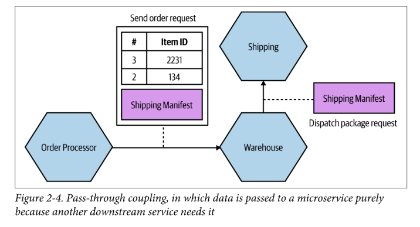

- [How to Model Microservices](#how-to-model-microservices)
  - [What makes a good microservice boundary?](#what-makes-a-good-microservice-boundary)
    - [1. Information Hiding](#1-information-hiding)
    - [2. Cohesion](#2-cohesion)
    - [3. Coupling](#3-coupling)
  - [The Interplay of Coupling and Cohesion](#the-interplay-of-coupling-and-cohesion)

# How to Model Microservices

## What makes a good microservice boundary?

Microservices are another form of modular decomposition. We need three things that are vital to the success of microservices:

### 1. Information Hiding

Describes a desire to `hide as many details as possible` behind a microservice. You have benefits from this approach, such as:

- **Improved development time**: You can develop different microservices in parallel reducing the impact of adding more developers to a project.
- **Comprehensibility**: You can look at a microservice in isolation and understood in isolation. Using `ubiquitous language`, you can understand what the microservice does.
- **Flexibility**: You can change a microservice without affecting other microservices.

Keeping a module's public interface small and well-defined is a good practice. It allows you to change the implementation without affecting the consumers of the module or if you change it, the change might be done in a safe way.

### 2. Cohesion

Means in a succinct definition: The code that changes together, stays together. It is a measure of how closely related and focused the responsibilities of a module are. A module with high cohesion is more focused and easier to understand.

You would like the functionality grouped in such way that we can make changes in as few places as possible. This is vital because it reduces the risk of making a mistake when changing the code and improve the isolation deployment of the module.

In a microservice arquitecture, you are aiming for strong cohesion.

### 3. Coupling

When services are loosely coupled, a change to one service should not require a change to another.

You should aim to avoid having multiple and different types of calls from one service to another. Moreover, you should avoid having chatty communication between services. This is because the more services communicate, the more coupling you have.

## The Interplay of Coupling and Cohesion

> A structure is stable if cohesion is strong and coupling is low.

Cohesion applies to the relationship between things `inside` a boundary. Coupling applies to the relationship between things `across` boundaries.

The world is not static! It's totally possible that our system requirements change and we have to rethink about the boundaries of our services.

## Types of Coupling

There are several types of coupling. Here are some of them using a scale from  `1` (low coupling) to `5` (high coupling):

### Domain Coupling

Describes a situation in which one microservice needs to interact with another one to fulfill a request.

This type of coupling rarely can be avoided because it's a natural consequence of the problem domain. The key is to keep it to a minimum remembering the importance of information hiding.

> **Temporal Coupling**: When one service must be called before another in a `Synchronous` way. You must to avoid this type of coupling.

### Pass-Through Coupling

Describes a situation in which one microservice passes data to another one purely because the data is needed by some other microservice further downstream.

One way to reduce this type of coupling is passing data throughout the chain without modifying it. This way, you can avoid the need of changing the data structure in all the services.

### Common Coupling

Occurs when two or more microservices share a common data structure. This is a form of coupling because if the data structure changes, all the services need to be updated.

Sharing static data could be no problem, but when you share dynamic data, you are coupling the services.

### Content Coupling

Describes a situation in which an upstream service reaches into the internals of a downstream service and changes its internal state.

A common manifestation is that an external service reaches into another service database and changes its state. This is a bad practice because it makes the downstream service dependent on the upstream service.

As devs, we should take care about boundaries and have a clear separation between what can be changed freely and what cannot.
